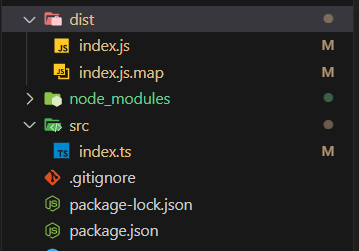

# SETTING UP ENVIRONMENT FOR TYPESCRIPT DEVELOPMENT

## Do the following
1. npm init -y
2. add the following to package.json: "type":"module"
3. Install typescript as dev dependency with the command: `npm install typescript --save-dev`
4. Add the following to the the "scripts" property in package.json: "build": "tsc --watch", "dev":"nodemon ./dist/index.js --watch ./dist"
5. Create an "src" directory in the root of the folder.
6. Install the following by typing the following in the root directory's command line: "npm i -D @types/node"
7. Create a tsconfig.json file. you could type this command `npx tsc --init` Or create a tsconfig.json file and copy the following into the tsconfig.json file: 
```json
{
  "compilerOptions": {
    "module": "NodeNext",
    "moduleResolution": "NodeNext",
    "target": "ES2020",
    "sourceMap": true,
    "outDir": "dist"
  },
  "include": ["src/**/*"]
}
```
Or
```json
{
  "compilerOptions": {
    "module": "CommonJS",
    "moduleResolution": "Node10",
    "target": "ES2020",
    "sourceMap": true,
    "outDir": "dist"
  },
  "include": ["src/**/*"]
}
```
8. npm install -g nodemon
9. npm install -g ts-node
10. npm install --save-dev ts-node

## This is how everything should look like
### folder structure


### package.json file
```json
{
  "name": "typescripttutorial",
  "version": "1.0.0",
  "description": "",
  "main": "index.js",
  "type": "module",
  "scripts": {
    "test": "echo \"Error: no test specified\" && exit 1",
    "build": "tsc --watch",
    "dev": "nodemon ./dist/index.js --watch ./dist"
  },
  "keywords": [],
  "author": "",
  "license": "ISC",
  "devDependencies": {
    "@types/node": "^20.5.7",
    "ts-node": "^10.9.1",
    "typescript": "^5.2.2"
  },
  "dependencies": {
    "nodemon": "^3.0.1"
  }
}
```

### tsconfig.json
```json
{
  "compilerOptions": {
    "module": "NodeNext",
    "moduleResolution": "NodeNext",
    "target": "ES2020",
    "sourceMap": true,
    "outDir": "dist"
  },
  "include": ["src/**/*"]
}
```

## Starting the setup
1. Open two terminal. in one type `npm run dev` and in the other type `npm run build`;
   - The `npm run dev` starts nodemon on the index.js and it listens to any changes in that folder file in the "dist" folder whilst `npm run build` listens for any changes in our index.ts file and builds the changes into index.js file. Any changes made will cause nodemon to display the info as such.